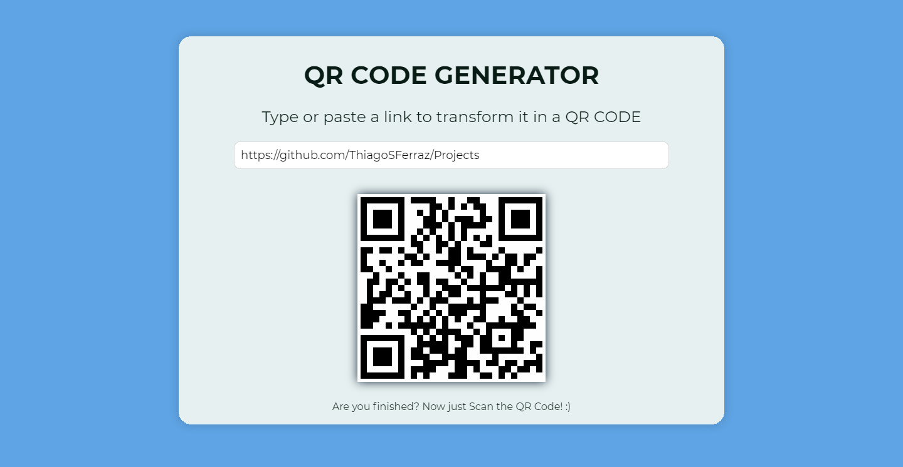
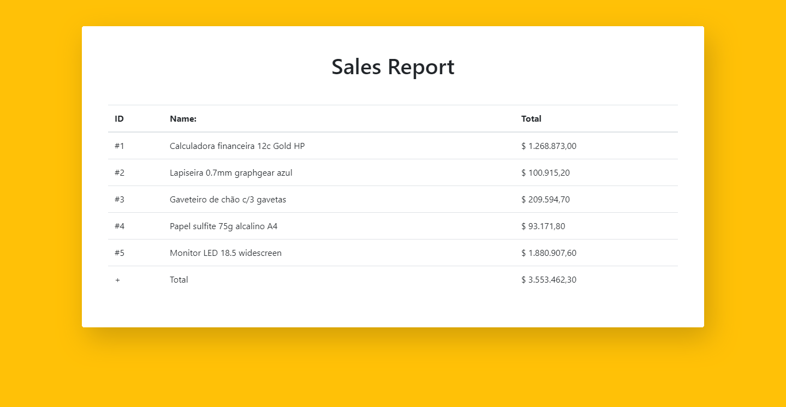
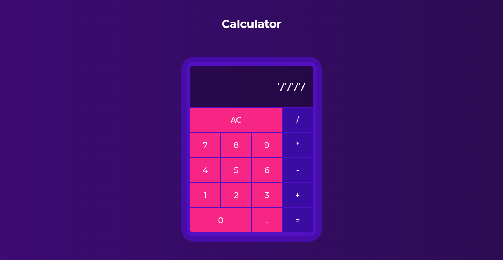

<h1 align="center" style="color: #00bb76; font-weight: 900;"> Vue.JS Projects </h1>

Execute the command <b>npm install</b> in this directory to install all the dependencies then read the step-by-step down bellow.
</ol>
<h1></h1>
<h2>🔳 QR Code Generator: </h2>

This is a project using some Vue features!

<h2 style="text-weight: 900;"> How to run the project?</h2>
<ul>
<li>Once you download the project you're going to enter in your <b>terminal</b> and go to this Vue directory. Then run the command  <b>npm run qrcode</b></li>
</ul>
<h1></h1>
<h2>💸Sales report:</h2>
This project is a simple project to know more about how Vue works with data.

<h2 style="text-weight: 900;"> How to run the project?</h2>
<ul>
<li>Once you download the project you're going to enter in your <b>terminal</b> and go to this Vue directory. Then run the command  <b>npm run sales</b></li>
</ul>
<h1></h1>
<h2>➕ Calculator: ➖</h2>

A calculator that I did using Vue, this one is going to be a little bit different in the installation part <b>BE AWARE</b>

<h2 style="text-weight: 900;"> How to run the project?</h2>
<ul>
<li>Go to the <b>terminal</b> and go to the Calculator directory (using the command <b>cd calculator</b>). Then run the command  <b>npm install</b></li>
<li>Then to open the project run the command <b>npm run serve</b></li>
</ul>

